# DataOps Taller

**Estudiante:** María Leyva
**Materia:** Enfoque DataOps

## Contenido

1. [Descripción del pipeline](#1-descripción-del-pipeline)
2. [Diagramas de flujo](#2-diagramas-de-flujo)
3. [Ejecución local](#3-ejecución-local)
4. [Decisiones de diseño](#4-decisiones-de-diseño)
5. [Resultados de las pruebas](#5-resultados-de-las-pruebas)
6. [Informe](#6-informe)

## 1. Descripción del pipeline

Este repositorio implementa un pipeline de datos con prácticas de DataOps para una tienda en línea simulada.

Estructura del pipeline:

1. Extrae los datos de ventas de una base de datos SQLite, que simula PostgreSQL.
2. Limpia y transforma los datos eliminando duplicados, manejando valores nulos y calculando métricas como las ventas totales por categoría y mes.
3. Entrena un modelo de regresión lineal para predecir las ventas del próximo mes.
4. Genera un reporte en formato CSV con las ventas agregadas.
5. Se ejecuta automáticamente con GitHub Actions en cada push a `main` o a ramas `feature/*`, y en cada Pull Request hacia `main`.

Además del código, el proyecto versiona los datos con DVC y snapshots, y el esquema con migraciones SQL. Con esto se busca un versionamiento holístico que garantice la reproducibilidad.

### 1.1 Tecnologías

| Componente | Herramienta | Versión |
|---|---|---|
| Lenguaje | Python | 3.12 |
| Base de datos | SQLite | (incluida en Python) |
| Procesamiento | pandas | 3.0.6 |
| Modelo | scikit-learn (regresión lineal) + joblib | 1.9.1 / 1.6.0 |
| Pruebas | pytest, pytest-cov | 9.1.1 / 7.1.0 |
| Análisis estático | pylint, black, bandit | 4.0.9 / 26.5.1 / 1.9.4 |
| CI/CD | GitHub Actions | |
| Versionamiento de código | Git + GitHub | |
| Versionamiento de datos | DVC | 3.67.1 |

### 1.2 Módulos

| Módulo | Función | Tarea |
|---|---|---|
| `scripts/create_db.py` | `crear_base_datos()` | Creación de la tabla `ventas` con 200 ventas simuladas, 6 valores nulos (3 en `cantidad`, 3 en `precio_unitario`) y 8 duplicados. Total: 208 filas. |
| `src/extract.py` | `extract_data(db_path)` | Lectura de la tabla `ventas` y retorna un DataFrame. Lanza `FileNotFoundError` si la base no existe y `RuntimeError` si falla la consulta. |
| `src/transform.py` | `clean_data(df)` | Eliminación de duplicados (ignorando el `id`), rellena `cantidad` nula con 0 y `precio_unitario` nulo con la media, y convierte `fecha` a datetime. |
| | `calculate_metrics(df)` | Agregación de `venta_total = cantidad × precio_unitario` y `mes`. |
| | `aggregate_sales(df)` | Agrupación por `categoria` y `mes`, sumando `venta_total`. |
| `src/utils.py` | `save_to_csv(df, path)` | Guardado del DataFrame en CSV, creando la carpeta si no existe. |
| `src/train.py` | `train_model(df)` | Suma de las ventas por mes, entrena una regresión lineal (X = `mes`, y = `venta_total`), guarda el modelo con joblib y retorna el modelo y el R². |
| | `run_pipeline()` | Ejecución del pipeline completo. Es el punto de entrada de `python -m src.train`. |
| `notebooks/exploracion.ipynb` | — | Análisis exploratorio que reutiliza las funciones de `src/` (en lugar de copiar el código), para que el notebook y el pipeline usen exactamente la misma lógica. |

### 1.3 Automatización con CI/CD

El workflow `.github/workflows/ci.yml` se ejecuta en cada **push** a `main` o `feature/*` y en cada **Pull Request** hacia `main`. Corre en una máquina `ubuntu-latest` limpia, lo que garantiza que el proyecto funcione fuera de la máquina de desarrollo. Si un paso falla, los siguientes no se ejecutan y el Pull Request no se puede considerar listo para integrar.

| Paso | Función | Etapa del pipeline CI/CD |
|---|---|---|
| Checkout | Descarga del código | |
| Set up Python | Instala Python 3.12, con caché de pip | Build Environment |
| Install dependencies | Instala `requirements.txt` con versiones fijadas | Build Environment |
| Create database | Regenera `ventas.db` (no está en Git). Gracias a la semilla, siempre son los mismos datos | |
| Run static analysis | `pylint --fail-under=7.0`, `black --check`, `bandit` | Static Analysis |
| Run unit and integration tests | pytest con cobertura (`coverage.xml`), sin pruebas de calidad | Unit & Integration Testing |
| Run data quality tests | Solo `test_data_quality.py`, en su propio paso | Data & Schema Testing |
| Train model | `python -m src.train` | Model Testing |
| Upload artifacts | Publica `model.pkl` (`trained-model`) y el CSV y la cobertura (`reports`) | Artifact |

### 1.4 Versionamiento de datos y esquemas

El proyecto aplica versionamiento holístico, donde el código se versiona con Git, los datos con DVC y snapshots, y el esquema con migraciones SQL.

- **Datos con DVC:** Git solo guarda el archivo `data/ventas.db.dvc`, que contiene el hash MD5 de la base de datos. Los datos reales se almacenan en un remoto de DVC, simulado con una carpeta local (`C:/Proyectos/dvcstore`).
- **Esquema con migraciones:** cada cambio en la estructura de la base de datos es un archivo SQL numerado en `migrations/`:

| Migración | Función |
|---|---|
| `V001_create_ventas_table.sql` | Crea la tabla `ventas` |
| `V002_add_index_on_fecha.sql` | Agrega un índice sobre `fecha` |
| `V003_add_column_descuento.sql` | Agrega la columna `descuento` (valor por defecto 0, para no afectar las filas existentes) |

  El script `scripts/apply_migrations.py` funciona como un Flyway simplificado: aplica las migraciones en orden y una sola vez, registrándolas en la tabla `schema_history`, y guarda un checksum (SHA-256) de cada migración para detenerse si una migración ya aplicada fue modificada.
- **Snapshots:** `scripts/create_snapshot.py` copia la base de datos a `data/snapshots/ventas_YYYYMMDD.db`, con una ejecución programada semanalmente.

## 2. Diagramas de flujo

### 2.1 Pipeline de datos

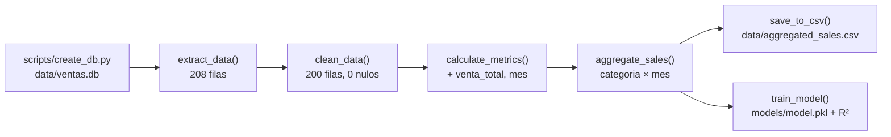

1. **`create_db.py`** genera la base `data/ventas.db` con 208 registros, incluyendo nulos y duplicados a propósito para simular datos reales.
2. **`extract_data()`** lee las 208 filas de la tabla `ventas` y las entrega como un DataFrame.
3. **`clean_data()`** elimina los 8 duplicados y rellena los 6 nulos, dejando 200 filas limpias.
4. **`calculate_metrics()`** agrega a cada venta su `venta_total` y el `mes` en que ocurrió.
5. **`aggregate_sales()`** resume las ventas por categoría y mes.
6. A partir de los datos agregados, el pipeline se divide en dos salidas:
   - **`save_to_csv()`** genera el reporte `data/aggregated_sales.csv`.
   - **`train_model()`** suma las ventas por mes, entrena la regresión lineal, guarda `models/model.pkl` y reporta el R².

### 2.2 Pipeline de CI/CD

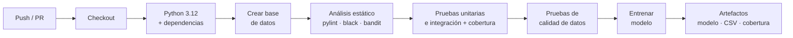

1. Un **push** o un **Pull Request** dispara el workflow.
2. GitHub Actions descarga el código, instala Python 3.12 y las dependencias con versiones fijadas.
3. Se **regenera la base de datos**, ya que no está en Git.
4. El **análisis estático** revisa calidad (pylint), formato (black) y seguridad (bandit) sin ejecutar el código.
5. Las **pruebas unitarias y de integración** validan el código y calculan la cobertura.
6. Las **pruebas de calidad de datos** validan el esquema y los valores de la tabla `ventas`.
7. Se **entrena el modelo** con el pipeline completo.
8. Se publican como **artefactos** el modelo, el reporte CSV y la cobertura, descargables desde GitHub.

Cada paso funciona como una puerta de calidad: si uno falla, los siguientes no se ejecutan.

## 3. Ejecución local

### 3.1 Instalación

```bash
# Clonar el repositorio
git clone https://github.com/kataleyva/dataops-taller-maria-leyva.git
cd dataops-taller-maria-leyva

# Crear y activar el entorno virtual
python -m venv venv
source venv/Scripts/activate      # Windows (Git Bash)
# source venv/bin/activate        # Linux / macOS

# Instalar dependencias
pip install -r requirements.txt       # pipeline
pip install -r requirements-dev.txt   # notebook
```

### 3.2 Ejecución del pipeline

```bash
# Generar la base de datos simulada (o descargarla con: dvc pull)
python scripts/create_db.py

# Ejecutar el pipeline
python -m src.train

# Ejecutar las pruebas
pytest --cov=src --cov-report=term-missing

# Análisis estático
pylint src/ --fail-under=7.0
black --check src/
bandit -r src/
```

Salida esperada de `python -m src.train`:

```
Registros limpios: 200
Reporte guardado en: .../data/aggregated_sales.csv
Modelo guardado en: .../models/model.pkl
R2 del modelo: 0.589
Prediccion de ventas para el mes 13: 5,071.61
```

*Nota:* la base de datos (`data/ventas.db`) no se versionó con Git. Se regenera con `scripts/create_db.py`, que usa una semilla fija para producir siempre los mismos datos, o se descarga con `dvc pull`.

### 3.3 Versionamiento de datos y esquemas

```bash
# DVC
dvc remote add -d myremote C:/Proyectos/dvcstore   # configurar el remoto (solo la primera vez)
dvc push                                           # subir los datos al remoto
dvc pull                                           # descargar los datos del remoto

# Volver a una versión anterior de los datos
git checkout <commit> -- data/ventas.db.dvc
dvc checkout

# Migraciones
python scripts/apply_migrations.py                 # aplica sobre data/ventas_migraciones.db
python scripts/apply_migrations.py <ruta.db>       # aplica sobre otra base de datos

# Snapshot manual
python scripts/create_snapshot.py
```

Programación semanal del snapshot (lunes 8:00 a. m.) en Windows:

```
schtasks /create /tn "DataOps snapshot semanal" /tr "<ruta>\venv\Scripts\python.exe <ruta>\scripts\create_snapshot.py" /sc weekly /d MON /st 08:00
```

## 4. Decisiones de diseño

### 4.1 Pipeline de datos

- **Semilla fija (`random.seed(42)`) en `create_db.py`:** los datos "aleatorios" son idénticos en cada ejecución y en cada máquina, permitiendo reproducibilidad: el CI regenera la base en cada ejecución y obtiene exactamente los mismos datos.
- **`id` asignado por SQLite (`INTEGER PRIMARY KEY`):** como en un sistema transaccional real. Permite simular duplicados realistas, la misma venta registrada dos veces con distinto `id`. Por eso `clean_data` busca duplicados ignorando el `id`.
- **Tendencia creciente en `cantidad`:** con cantidades puramente aleatorias, el R² era 0.004: el mes no estaba explicando nada. Por lo que se decidió aplicar una tendencia mensual. Así, el R² es 0.589 y el modelo aprende un patrón.
- **Precios fijos del catálogo:** como cada producto tiene un único precio, se simplifica la interpretación de las ventas.
- **`cliente_id` aleatorio entre 1 y 50:** simula clientes recurrentes (en promedio, 4 compras por cliente), como en una tienda real.
- **Validación de existencia antes de conectar:** `sqlite3.connect()` crea un archivo vacío si la base no existe. Validar primero da un error claro en vez de un confuso `no such table`.
- **Funciones puras (`df.copy()`):** las transformaciones no modifican el DataFrame original, lo que las hace predecibles y fáciles de probar.
- **`model_path` como parámetro de `train_model`:** permite que las pruebas guarden el modelo en una carpeta temporal sin sobrescribir `models/model.pkl`.
- **Consultas SQL parametrizadas:** evitan inyección SQL. bandit lo verifica en el CI.
- **Notebook sin salidas:** las salidas del notebook se limpian antes de cada commit para evitar diffs ilegibles, archivos pesados y posibles fugas de datos.

### 4.2 Dependencias y CI/CD

- **Versiones fijadas en `requirements.txt`:** black formatea distinto entre versiones. Sin fijarlas, el código podía pasar localmente y fallar en el CI.
- **`requirements-dev.txt` separado:** el CI no necesita matplotlib ni Jupyter. Separarlos hace el pipeline más eficiente.
- **Cambios respecto al workflow base del taller:**

| Cambio realizado | Causa |
|---|---|
| `actions/checkout@v4`, `setup-python@v5`, `upload-artifact@v4` | `upload-artifact@v3` fue descontinuada y hace fallar el workflow. Las demás usaban una versión de Node.js sin soporte. |
| Python `3.12` en vez de `3.9` | Igual al entorno de desarrollo (reproducibilidad). Python 3.9 ya no tiene soporte. |
| Se eliminó `pip install pylint black bandit` | Al ya estar presentes en `requirements.txt` con versión fija. Instalarlos sin versión podía traer un black con otro formato. |
| `python -m src.train` en vez de `python src/train.py` | Con la segunda forma, `from src.extract import ...` falla con `ModuleNotFoundError`. |
| `--ignore=tests/test_data_quality.py` en el paso de pruebas unitarias | Evita que las pruebas de calidad se ejecuten dos veces. |

### 4.3 Versionamiento

- **Datos ignorados por extensión (`*.db`, `*.csv`) y no por carpeta:** inicialmente se ignoraba la carpeta completa (`data/*`) con la excepción `!data/*.dvc`. Git respeta esa excepción, pero DVC dejaba de detectar los archivos `.dvc` que están dentro de una carpeta ignorada.
- **Remoto de DVC en `C:/Proyectos/dvcstore`:** la ruta sugerida (`/tmp/dvcstore`) no existe en Windows. El remoto está fuera del repositorio porque simula un almacenamiento externo.
- **Migraciones sobre una base aparte (`ventas_migraciones.db`):** si una migración cambia el esquema sin actualizar las pruebas, `test_esquema_tipos_de_columnas` falla y detiene el pipeline. Aplicarlas sobre `ventas.db` requeriría actualizar en el mismo cambio `create_db.py` y las pruebas de esquema. En un entorno real, las migraciones se ejecutarían en el CI **antes de las pruebas**:

```yaml
- name: Apply schema migrations
  run: python scripts/apply_migrations.py data/ventas.db
  # Con Flyway: flyway -url=jdbc:postgresql://... -locations=filesystem:migrations migrate
```

- **Snapshots con formato `YYYYMMDD`:** el formato año-mes-día mantiene los snapshots ordenados cronológicamente. Son complementarios a DVC: los snapshots sirven para respaldo y auditoría, y DVC para reproducibilidad.

## 5. Resultados de las pruebas

| Métrica | Resultado |
|---|---|
| Pruebas | 17 passed (6 de calidad de datos, 3 de integración, 8 unitarias) |
| Cobertura total de `src/` | 75 % (`transform.py` 100 %, `extract.py` 85 %, `train.py` 65 %, `utils.py` 40 %) |
| pylint | 8.31 / 10 (mínimo exigido: 7.0) |
| black | Sin cambios pendientes |
| bandit | Sin problemas de seguridad |
| GitHub Actions | ✅ en `main` (el primer push falló por formato y se corrigió con `black`) |

Las pruebas unitarias `test_transform.py` confirman que el **código** haga lo correcto, con un DataFrame pequeño construido a mano (1 duplicado y 2 nulos): eliminación de duplicados, relleno de nulos (cantidad → 0, precio → media), conversión de fechas, `venta_total`, `mes` y agregación. Las de esquema y calidad `test_data_quality.py` revisan que los **datos** crudos cumplan las reglas: columnas esperadas, tipos del esquema en SQLite (`PRAGMA table_info`), cantidades no negativas, precios > 0, sin fechas futuras y formato `YYYY-MM-DD`. Por último, las pruebas de integración `test_integration.py` validan que los **módulos del pipeline encajen**: extraer, transformar y agregar con la base real, entrenar y guardar el modelo en una carpeta temporal, y fallar correctamente si la base no existe.

### 5.1 Pruebas locales

Ejecución de `pytest -v` con las 17 pruebas aprobadas:

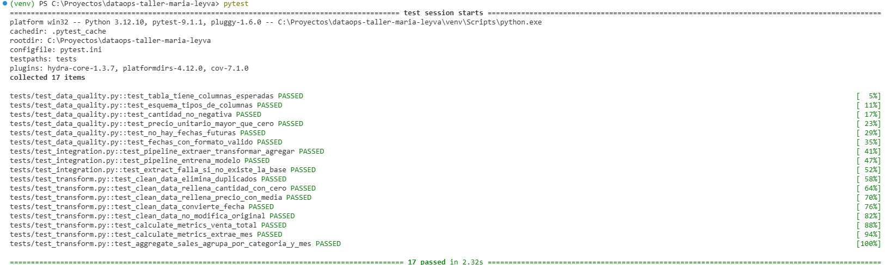

<!--  -->

### 5.2 Ejecución en GitHub Actions

El primer push del workflow falló en el paso de análisis estático: `black --check` encontró 4 archivos sin el formato estándar, y el pipeline se detuvo antes de entrenar el modelo:

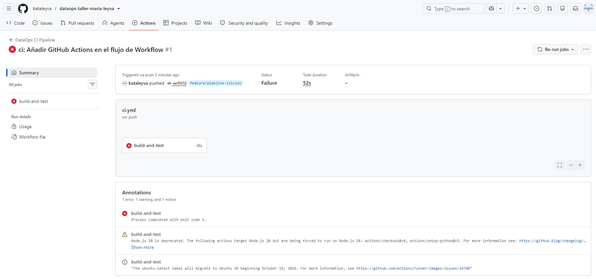

Después de formatear el código con `black src/` y hacer un commit (`style:`), el pipeline pasó:

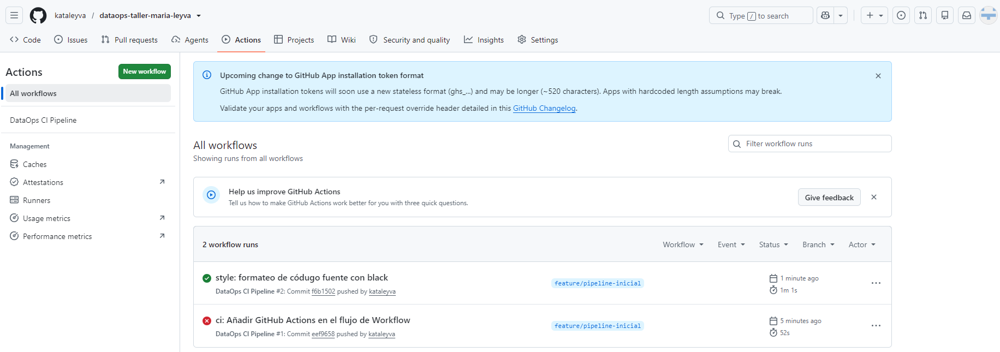

<!--  -->

---

## 6. Informe

### 6.1 Introducción

El objetivo del taller fue asumir el rol de Ingeniero DataOps y diseñar, implementar y documentar un pipeline de CI/CD para un proyecto de datos de una tienda en línea que necesita extraer sus ventas, limpiarlas, calcular métricas, entrenar un modelo de predicción y generar un reporte, todo de forma automática y reproducible.

Los objetivos específicos fueron:
- Aplicar buenas prácticas de Git: ramas de característica, commits atómicos y Pull Requests.
- Construir un pipeline de datos modular y probado en sus tres niveles (unitario, calidad de datos e integración).
- Automatizar su validación con GitHub Actions.
- Versionar no solo el código, sino también los datos (DVC, snapshots) y el esquema (migraciones).

### 6.2 Desarrollo

#### Tarea 1: Configuración del repositorio y versionamiento

Se creó el repositorio `dataops-taller-maria-leyva` con un README inicial, un `.gitignore` que excluye entornos virtuales, datos, configuración sensible y archivos temporales, y la estructura de carpetas del proyecto. El trabajo se desarrolló en la rama `feature/pipeline-inicial`.

Repositorio en GitHub con la estructura de carpetas, en la rama `feature/pipeline-inicial`:

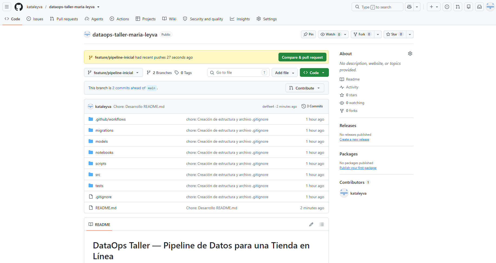

Estructura del proyecto en VS Code. `venv/` aparece en gris porque está ignorado por Git:

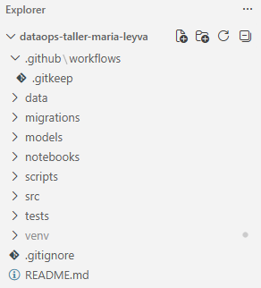

Primeros commits de la rama, comparados con `main`:

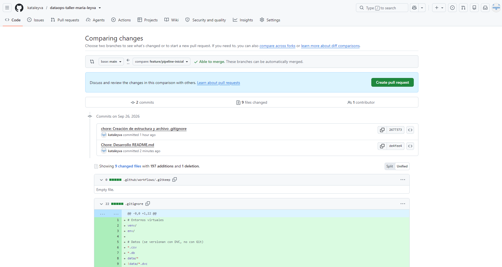

#### Tarea 2: Desarrollo del pipeline de datos

Se instalaron las dependencias con versiones fijadas en `requirements.txt`:

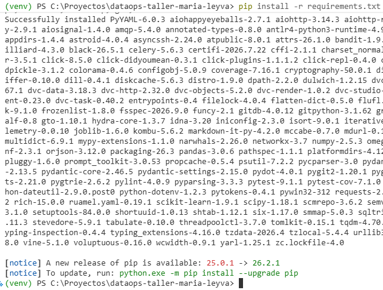

Se implementaron `create_db.py` y los módulos `extract`, `transform`, `utils` y `train` (ver [sección 1](#1-descripción-del-pipeline)). Con los datos limpios (200 registros), la regresión lineal obtuvo un **R² de 0.589** y predice **$5,071.61** en ventas para el mes 13: el mes explica cerca del 59 % de la variación de las ventas mensuales.

<!--  -->

**Análisis exploratorio** (`notebooks/exploracion.ipynb`). La base cruda tiene 208 filas y 7 columnas:

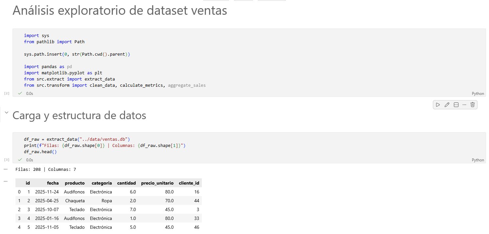

Revisión de calidad: 3 nulos en `cantidad`, 3 en `precio_unitario` y 8 duplicados:

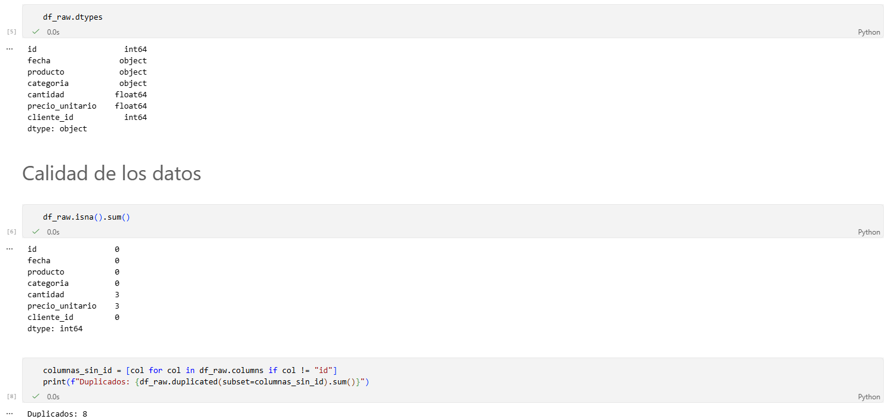

No hay cantidades negativas, precios ≤ 0 ni fechas fuera de 2025. Después de la limpieza quedan 200 filas y 0 nulos:

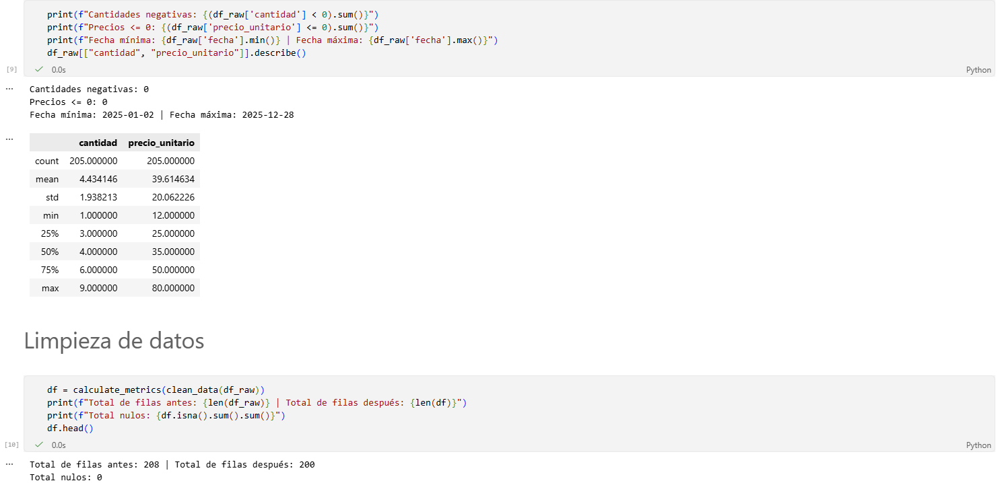

Datos limpios con las columnas calculadas `venta_total` y `mes`:


Ventas por categoría:

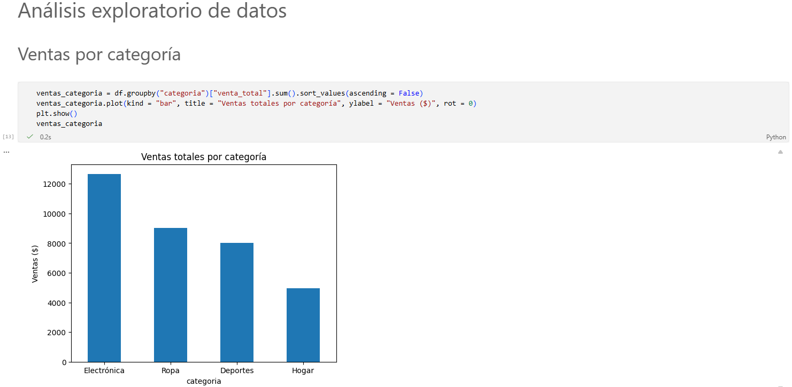
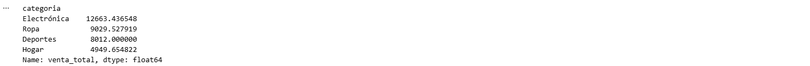

Tendencia mensual, que es la relación que usa el modelo:

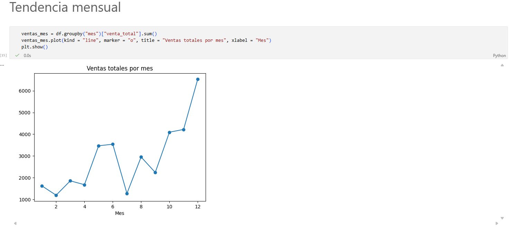

Clientes recurrentes y conclusiones del análisis:

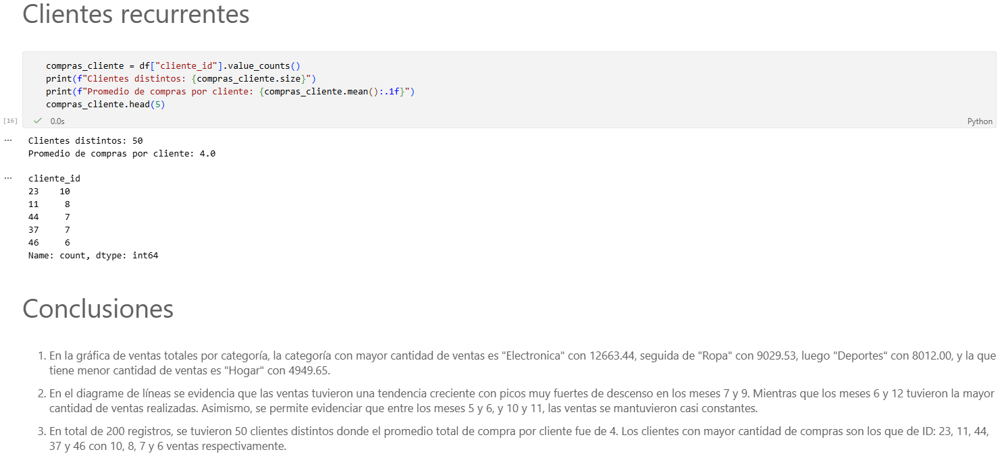

Conclusiones del análisis exploratorio:
1. **Electrónica** es la categoría con más ventas ($12,663.44), seguida de Ropa ($9,029.53), Deportes ($8,012.00) y Hogar ($4,949.65).
2. Las ventas muestran una **tendencia creciente** a lo largo del año, con caídas fuertes en los meses 7 y 9, y los valores más altos en los meses 6 y 12.
3. Hay **50 clientes distintos**, con un promedio de 4 compras por cliente. Los clientes con más compras son 23, 11, 44, 37 y 46 (10, 8, 7, 7 y 6 compras).

#### Tarea 3: Pruebas unitarias y de calidad de datos

Se implementaron 17 pruebas en tres niveles. Todas pasan localmente con `pytest -v` (ver capturas en la [sección 5.1](#51-pruebas-locales)).

| Métrica | Resultado |
|---|---|
| Pruebas | 17 passed (6 de calidad de datos, 3 de integración, 8 unitarias) |
| Cobertura total de `src/` | 75 % (`transform.py` 100 %, `extract.py` 85 %, `train.py` 65 %, `utils.py` 40 %) |
| pylint | 8.31 / 10 (mínimo exigido: 7.0) |
| black | Sin cambios pendientes |
| bandit | Sin problemas de seguridad |

#### Tarea 4: Configuración del pipeline de CI/CD

Se configuró el workflow de GitHub Actions (ver [sección 1.3](#13-automatización-con-cicd)). El primer push del workflow falló por formato y, tras corregirlo con `black`, el pipeline pasó (ver capturas en la [sección 5.2](#52-ejecución-en-github-actions)).

El Pull Request #2 ejecutó los checks de nuevo (por el disparador `pull_request`) y mostró el historial completo de commits atómicos de la rama:

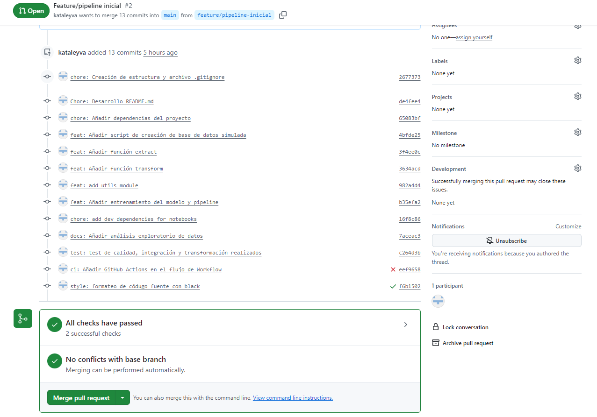

Finalmente se integró a `main` con todos los checks en verde:

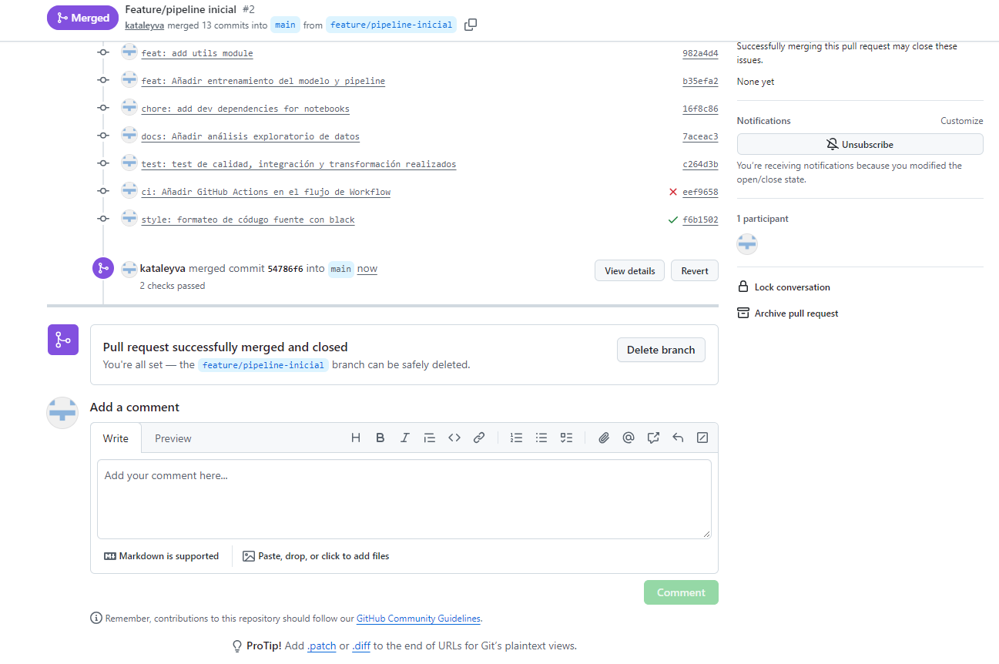

#### Tarea 5: Versionamiento de datos y esquemas

Se trabajó en la rama `feature/versionamiento_datos`, integrada con el PR #3 (ver [sección 1.4](#14-versionamiento-de-datos-y-esquemas)).

**DVC.** Inicialización del repositorio de DVC:

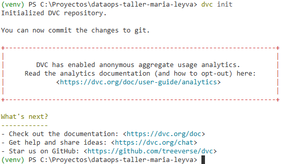

<!--  -->

Para comprobar el versionamiento, se cambió temporalmente `num_registros` de 200 a 300 y se volvió a ejecutar `dvc add`. Git solo ve cambiar dos líneas del puntero, aunque la base de datos completa sea distinta:

| Versión | Registros | MD5 | Tamaño |
|---|---|---|---|
| v1 | 208 | `fd33c133553066f486d37ba32fc71db1` | 20 480 bytes |
| v2 | 308 | `790b28a886da96c262be85634f66228d` | 24 576 bytes |

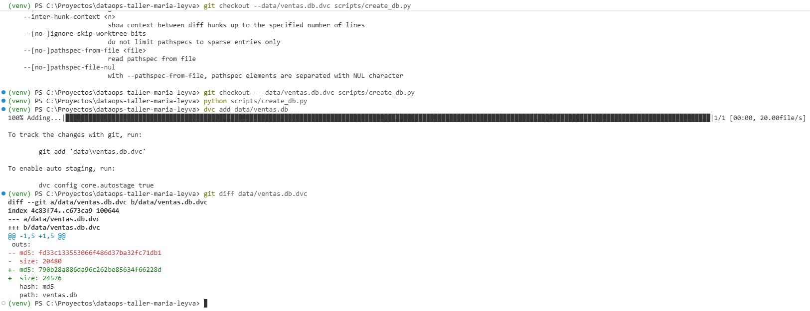

Con `git checkout -- data/ventas.db.dvc` y `dvc checkout` se volvió de la versión de 308 filas a la de 208, recuperando los datos desde la caché de DVC:

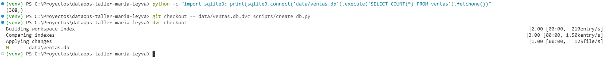

**Migraciones.** La primera ejecución aplica las tres migraciones. La segunda no aplica ninguna, porque ya están registradas en `schema_history` (idempotencia):

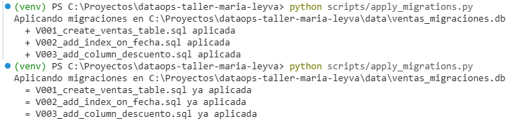

**Snapshots.** Se programó la ejecución semanal de `create_snapshot.py` con el Programador de tareas de Windows:

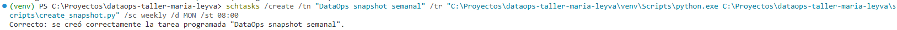

Resultado en `data/`: el snapshot fechado, la base de migraciones, la base de ventas y su puntero `.dvc`:

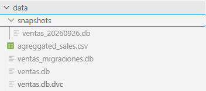

### 6.3 Análisis

#### ¿Qué diferencias hay entre CI/CD tradicional y CI/CD para datos?

1. **El código no es lo único que puede fallar.** En software tradicional, si el código no cambia, el resultado tampoco. En datos, el código puede estar perfecto y los datos llegar mal (nulos, negativos, fechas futuras). Por eso el pipeline tiene un paso exclusivo de **pruebas de calidad de datos**, que no existe en el CI tradicional.
2. **El "build" incluye generar datos y entrenar.** El pipeline no solo instala y prueba: regenera la base de datos y entrena un modelo. El resultado depende del código **y** de los datos.
3. **El artefacto es intangible.** El entregable no es un ejecutable, sino un `model.pkl` y un CSV. Un modelo puede "compilar" y ser inútil: con cantidades aleatorias el R² fue 0.004 y el pipeline igual pasaba. Validar la calidad del modelo requiere métricas, no solo que el código corra.
4. **Los datos no viven en Git.** El CI tuvo que regenerar la base con `create_db.py` porque `ventas.db` está ignorada. En un proyecto real, el CI necesitaría acceso al remoto de datos (DVC, S3) o un conjunto de datos de prueba.
5. **El determinismo hay que construirlo.** En el software tradicional la misma entrada da la misma salida. Con datos simulados y modelos, la aleatoriedad debe controlarse explícitamente (semilla fija) para que el CI sea confiable.

#### ¿Qué desafíos específicos se enfrentaron al versionar datos?

1. **Conflicto entre Git y DVC.** Ignorar `data/*` con la excepción `!data/*.dvc` funciona en Git, pero DVC deja de ver sus archivos `.dvc`: `dvc push` y `dvc pull` decían "Everything is up to date" sin hacer nada. Se resolvió ignorando los datos por extensión. Las herramientas de versionamiento de código y de datos deben configurarse para convivir.
2. **Dos flujos que sincronizar.** `git push` sube el puntero y `dvc push` sube los datos. Si se olvida el segundo, el repositorio apunta a datos que nadie más puede descargar.
3. **Diferencias ilegibles.** Git muestra un diff línea por línea del código, pero de los datos solo se ve que cambió el hash. Para saber *qué* cambió (100 filas nuevas) hay que inspeccionar los datos.
4. **Portabilidad.** El remoto sugerido (`/tmp/dvcstore`) no existe en Windows. Además, el remoto local no es accesible desde GitHub Actions, por lo que el CI no puede ejecutar `dvc pull`.
5. **Cambios de esquema.** Agregar una columna (V003) rompe la prueba de esquema, que espera 7 columnas. Un cambio de esquema debe ir coordinado con los datos, el código y las pruebas en el mismo cambio.

#### ¿Cómo se aseguró la reproducibilidad del experimento?

- **Semilla fija:** `create_db.py` produce exactamente el mismo archivo en cada ejecución. El hash MD5 `fd33c133553066f486d37ba32fc71db1` fue idéntico en ejecuciones independientes, byte por byte.
- **Mismos resultados en máquinas distintas:** el pipeline obtuvo el mismo R² (0.589) y la misma predicción ($5,071.61) localmente y en entornos separados.
- **Entorno aislado y versiones fijadas:** entorno virtual (`venv`) y `requirements.txt` con versiones exactas. Python 3.12 tanto local como en el CI.
- **Máquina limpia en cada ejecución:** GitHub Actions ejecuta todo desde cero en `ubuntu-latest`, lo que descarta el "en mi máquina sí funciona".
- **Versionamiento holístico:** Git (código), DVC (datos) y migraciones (esquema). Cualquier commit puede reconstruir el código, los datos y la estructura con los que se generó un resultado.

### 6.4 Conclusiones

**Lecciones aprendidas**
- **El CI detecta problemas antes que las personas.** El primer push del workflow falló por formato. Sin el pipeline, ese código habría llegado a `main` sin que nadie lo notara.
- **Guardar y revisar antes de ejecutar.** Varios errores se debieron a archivos sin guardar (`train.py`, el notebook) o a cambios sin commit. `git status` antes de cada cambio de rama o PR evita la mayoría.
- **Los errores silenciosos son los más peligrosos.** Omitir `clean_data` no genera ningún error, pero entrena el modelo con datos sucios. Las pruebas de integración existen para eso.
- **Las pruebas deben poder fallar.** Cambiar `.mean()` por `.median()` hace fallar exactamente `test_clean_data_rellena_precio_con_media`, lo que confirma que la prueba sirve.
- **La orquestación es necesaria.** Al cambiar `create_db.py` había que recordar ejecutar `create_db.py` y luego `train.py`, en ese orden. Con más pasos, hacerlo a mano no es viable.

**Limitaciones**
- SQLite simula PostgreSQL, pero no tiene concurrencia, usuarios ni el mismo dialecto SQL.
- El modelo usa `mes` como número de 1 a 12: solo funciona con datos de un año, y 12 puntos son muy pocos para un modelo confiable.
- Rellenar el precio nulo con la media produce valores que no existen en el catálogo. Sería más lógico usar el precio del mismo producto.
- El remoto de DVC es una carpeta local: no es compartible ni accesible desde el CI.
- El pipeline no incluye despliegue (CD) ni orquestación con Airflow o Prefect.
- La cobertura es del 75 %: `run_pipeline()` solo se valida en el paso de entrenamiento del CI.
- Los mensajes de commit mezclan español e inglés. Un equipo debería acordar un solo idioma desde el inicio.

**Recomendaciones para un equipo real**
- Proteger `main`: exigir Pull Request, revisión de al menos una persona y CI en verde antes de integrar.
- Usar un remoto de DVC compartido (S3, Azure Blob, Google Cloud Storage) y ejecutar `dvc pull` en el CI.
- Agregar validaciones declarativas de datos con Great Expectations y un umbral mínimo de calidad del modelo (por ejemplo, R² ≥ 0.5) como puerta del pipeline.
- Orquestar el pipeline con Airflow o Prefect y registrar modelos y métricas con MLflow.
- Agregar un ambiente de staging y una estrategia de despliegue (blue-green o canary) con rollback.

### 6.5 Reflexión final

#### ¿Qué haría diferente con 10 TB de datos y 20 científicos de datos?

| Aspecto | Con 10 TB y 20 personas |
|---|---|
| Almacenamiento | Data lake o lakehouse con formatos de tabla (Delta Lake, Apache Iceberg) |
| Versionamiento de datos | *Time travel* de Delta Lake/Iceberg o lakeFS. DVC con 10 TB sería lento y costoso de mover |
| Procesamiento | Spark o motores distribuidos. 10 TB no caben en memoria |
| CI | Pruebas con muestras pequeñas y representativas. Los datos completos solo en staging |
| Calidad de datos | Great Expectations o dbt tests, ejecutados en cada carga |
| Orquestación | Airflow o Prefect con dependencias, reintentos y alertas |
| Modelos | Registro de modelos (MLflow) con versiones, métricas y aprobación |
| Colaboración | Protección de ramas, *code owners*, revisiones obligatorias y convenciones acordadas |
| Entornos | Dev, staging y producción separados, con infraestructura como código |
| Monitoreo | Monitoreo de *data drift* y del desempeño del modelo en producción |

Con 20 personas, el mayor riesgo deja de ser técnico y pasa a ser de coordinación, dado que dos personas pueden cambiar el mismo esquema, alguien puede entrenar con datos distintos o un cambio puede romper el trabajo de otro. Por eso cobran más peso las convenciones, las revisiones y la automatización.

#### ¿Qué herramientas comerciales podrían facilitar el proceso?

- **Databricks:** Integra en una sola plataforma el almacenamiento (Delta Lake, con versionamiento y *time travel* de datos), el procesamiento distribuido con Spark, el registro de modelos (MLflow), la orquestación de trabajos y la gobernanza (Unity Catalog). Resolvería el versionamiento de 10 TB y la colaboración en notebooks compartidos.
- **Dataiku:** Ofrece flujos visuales para pipelines de datos y modelos, con colaboración entre perfiles técnicos y de negocio, trazabilidad y gobernanza de proyectos. Es útil si el equipo tiene distintos niveles técnicos.
- **AWS SageMaker:** Cubre el ciclo de vida de los modelos: entrenamiento escalable, SageMaker Pipelines (CI/CD de modelos), Model Registry, despliegue de endpoints con estrategias como blue-green y Model Monitor para detectar *drift*.

### 6.6 Referencias

- Bandit. *Bandit documentation*. https://bandit.readthedocs.io/
- Black. *The uncompromising code formatter*. https://black.readthedocs.io/
- Conventional Commits. *Conventional Commits 1.0.0*. https://www.conventionalcommits.org/
- Databricks. *Delta Lake documentation*. https://docs.delta.io/
- DataOps Manifesto. *The DataOps Manifesto*. https://dataopsmanifesto.org/
- DVC. *Data Version Control documentation*. https://dvc.org/doc
- Flyway. *Flyway documentation*. https://documentation.red-gate.com/flyway
- GitHub. *GitHub Actions documentation*. https://docs.github.com/actions
- pandas. *pandas documentation*. https://pandas.pydata.org/docs/
- Pylint. *Pylint documentation*. https://pylint.readthedocs.io/
- pytest. *pytest documentation*. https://docs.pytest.org/
- scikit-learn. *LinearRegression*. https://scikit-learn.org/stable/modules/generated/sklearn.linear_model.LinearRegression.html
- SQLite. *SQLite documentation*. https://www.sqlite.org/docs.html